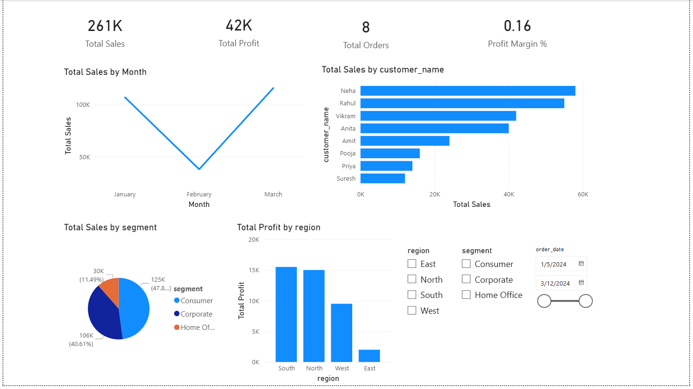
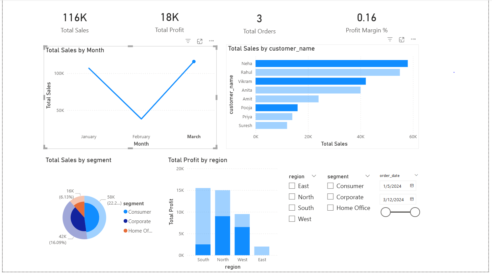
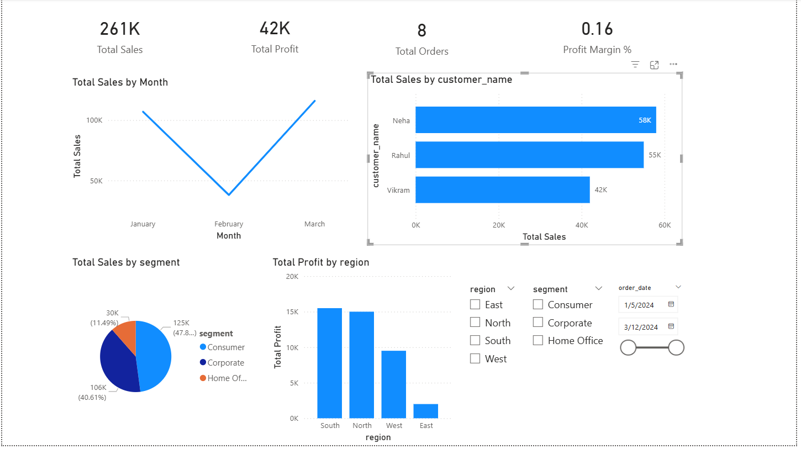

# 📊 Customer Sales & Profit Dashboard (Power BI)

## 📌 Project Overview
This project focuses on analyzing customer-level sales and profit data to identify key revenue drivers, profitable customer segments, and regional performance using Power BI.

## 🎯 Objectives
- Identify top customers by sales
- Analyze profit contribution by region and segment
- Track monthly sales trends
- Enable interactive filtering using slicers

## 🛠 Tools Used
- Power BI Desktop
- CSV Dataset (Customer Sales Data)

## 📂 Dataset
- Source: Simulated sales dataset
- Fields: Order Date, Customer Name, Segment, Region, Product, Sales, Profit

## 📈 Dashboard Features
- KPI cards for Total Sales, Total Profit, Orders, and Profit Margin
- Monthly sales trend line chart
- Top customers bar chart
- Sales by customer segment pie chart
- Profit by region column chart
- Date, Region, and Segment slicers

## 📊 Dashboard Preview
### Overall Dashboard

### Monthly Sales Trend

### Top Customers by Sales

## 🔍 Key Insights
- Corporate customers generate higher profit
- Laptops are the most profitable products
- South and North regions contribute maximum sales
- Strong sales growth observed in later months

## ▶️ How to Run This Project
1. Download the CSV file from the `data` folder
2. Open Power BI Desktop
3. Load the CSV file
4. Open the `.pbix` file to explore the dashboard

## 👤 Author
**Siva Krishnaprasad Paladugu**  
Fresher Data Analyst | Power BI
